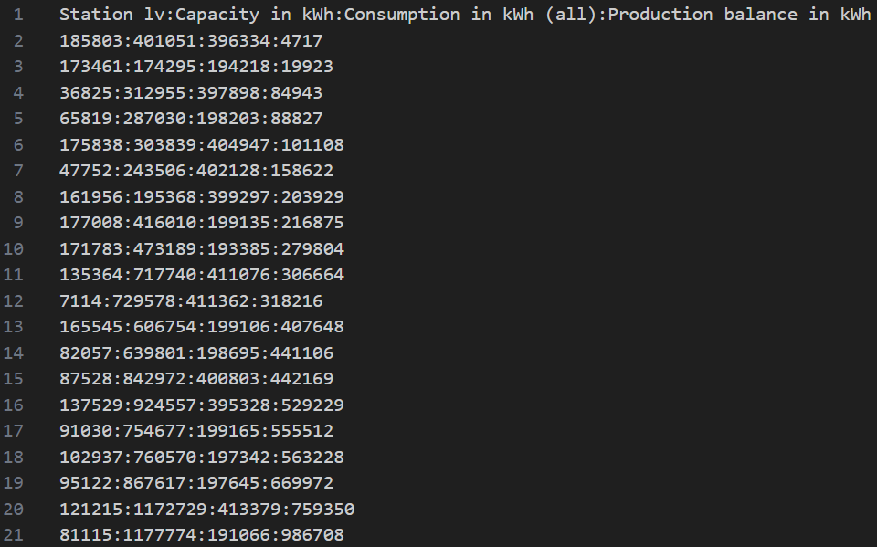
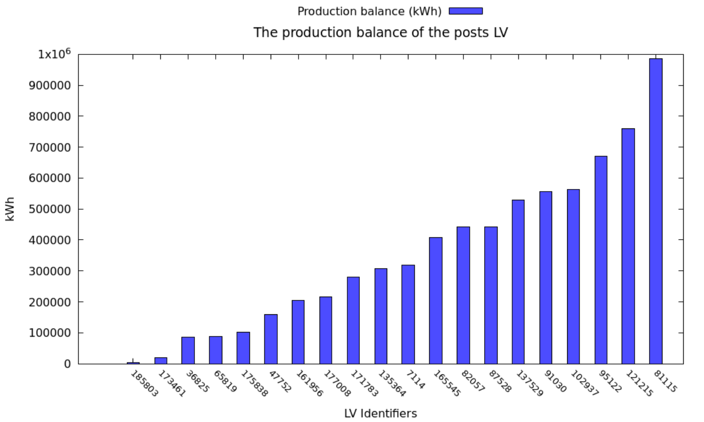

<h1 align="center">⚡ C-Wire ⚡</h1>

## Introduction

**C-Wire** is a project built in C and Shell for our second year of preparatory engineering studies. This project's goal is to make a data synthesis of an electricity ditribution system by analyzing the consumption of the companies or the individuals in terms of energy coming from each type of station (Power plants, HVB stations, HVA stations, LV posts). The part of processing the `.csv` input file to keep only the useful informations is done with the Shell script, and the part of the summation of the load of the consumers directly connected to a station is done with the C program using a balanced binary search tree to optimize the process duration.

### Input file

The input file is a `.csv` file with a `;` delimiter. It contains 8 columns with each column having respectively the following informations : 
- Power plant identifier
- HVB station identifier
- HVA station identifier
- LV post identifier
- Company identifier
- Individual identifier
- Capacity in kWh
- Load in kWh

Example of an input file : 


1;-;1;-;8910770;-;-;4265327 defines the company with a load of 4265327 kWh and the identifier 891077 related to the HVA station with the identifier 1 related to the power plant with the identifier 1.

### Output file

The output file is a `.csv` file with a `:` delimiter sorted by the second column containing the capacity. It contains 4 columns with each column having respectively the following informations : 
- Station (HVB or HVA or LV) identifier
- Capacity in kWh
- Consumption in kWh (The sum of the load of all the consumers directly connected to the station)
- Production balance in kWh (The absolute value of the substraction between the capacity and the consumption)

Example of an output file (after the command `lv all`) : 


163167:115326:312225:196899 defines the post LV with the identifier 163167 and a capacity of 115326 kWh and the sum of the load of the consumers directly connected to this lv post is 312225 kWh and its production balance is 196899 kWh.

If the user executes the command `lv all`, adding to the regular output file, another `.csv` file is created containing the 10 LV posts with the higher consumption and the 10 LV posts with the lower consumption, sorted by the column containing the production balance. It also generates a bar graph with a gnuplot script containing the production balance in kWh of each of these 20 posts LV.

Example of a minmax output file (after the command `lv all`) : 



Example of a bar graph (after the command `lv all`) : 



## Prerequisites

- **C compiler** such as `gcc` is required to compile the C program.
- A working **Shell** environment to execute the **Shell** script.
- **Gnuplot** in order to generate bar graphs with the output files.

## Installation

1. **Install gnuplot with the following command :** 
```sh
sudo apt update && sudo apt install gnuplot
```

2. **Clone the repository :** 
```sh
git clone https://github.com/RayyyZen/C-Wire.git
```

3. **Move into the project folder :** 
```sh
cd C-Wire
```

4. **Execute the project :**

To execute the project the user must execute the command `bash c-wire.sh` followed by the path of the `.csv` file then the type of station to process (hvb or hva or lv) after that the type of consumer to process (comp or indiv or all) and finally a specified power plant identifier to process (optional).

Example :
```sh
bash c-wire.sh lv all 1
```

To display the help containing the instructions to execute the program, execute the following command :
```sh
bash c-wire.sh -h
```

## License

This project is licensed under the BSD 2-Clause License. See the [LICENSE](LICENSE) file for details.
